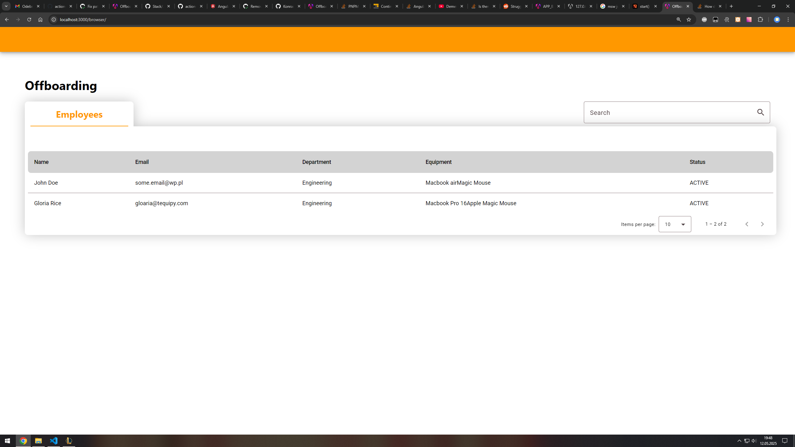
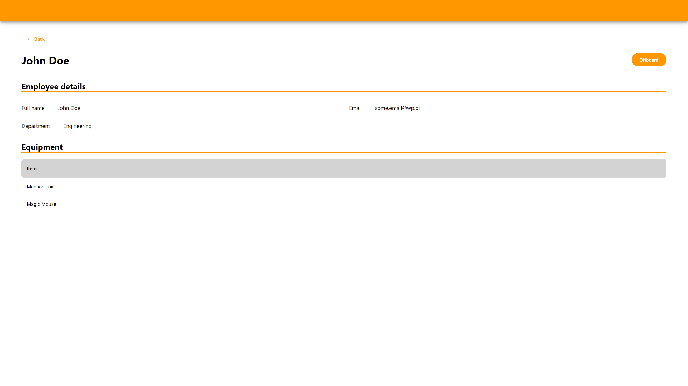
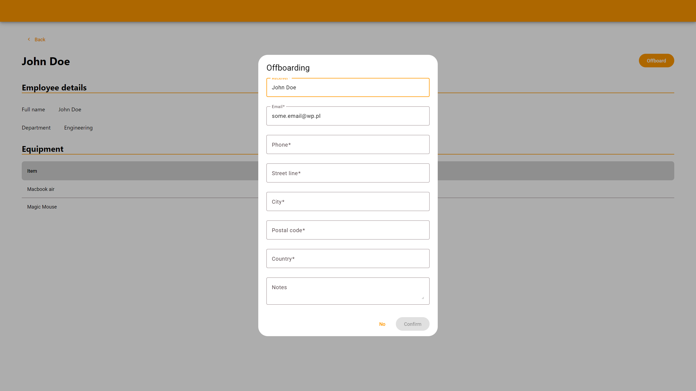

# Offboarding

This project was generated using [Angular CLI](https://github.com/angular/angular-cli) version 19.2.9.

## Development server

To start a local development server, run:

```bash
ng serve
```

Once the server is running, open your browser and navigate to `http://localhost:4200/`. The application will automatically reload whenever you modify any of the source files.

## Screenshots





## About

I must admit that it took me much more time than I expected. I've had a break with Angular and I wanted to prepare for that. I've read most of the Angular guide and was surprised with some of the new changes.

I tried using new stuff whenever it's possible so I probably overused signals.

Overall it was fun to refresh my knowledge and learn something new.

### Mocks

For mocks I decided to use [mswjs](https://mswjs.io/) mostly because I'm familiar with this technology from my previous projects.

### Tests

I didn't write any tests here. There is no business logic to test.

I could've write integration tests but it didn't seem worth for an app with 3 components.

### Forms

There is only one form and it's handled using Angular's [Reactive Forms](https://angular.dev/guide/forms/reactive-forms).

### Tables

For tables [Material Table](https://material.angular.dev/components/table/overview) is used. Kind of seems like an overkill though.
